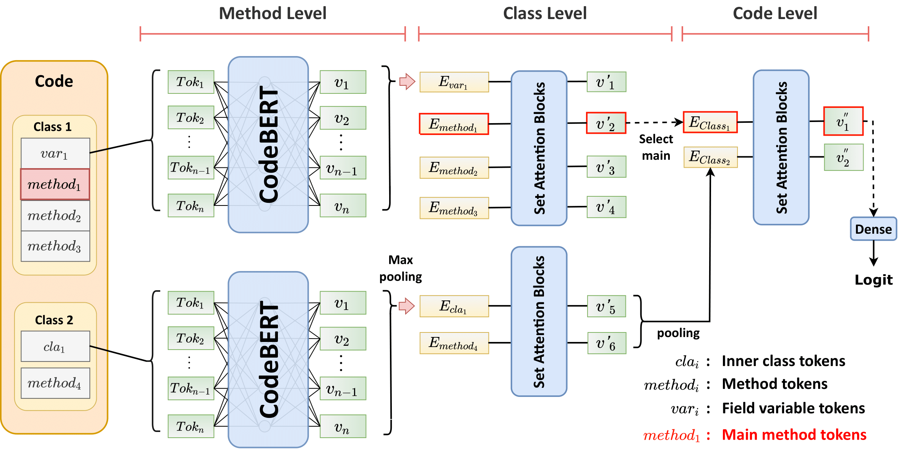

# Deep Learning-based Code Complexity Prediction 
### Submitted to NeurIPS 2022 Datasets and Benchmark Track

By Mingi Jeon, Seung-yeop Baik, Joonghyuk Hahn, Yo-Sub Han, Sang-Ki Ko

# Introduction

Deciding the computational complexity of algorithms is a really challenging problem even for human algorithm experts. Theoretically, the problem of deciding the computational complexity of a given program is undecidable due to the famous Halting problem. In this paper, we tackle the problem by designing a neural network that comprehends the algorithmic nature of codes and estimates the worst-case complexity.

First, we construct a code dataset called the CodeComplex that consists of 4,517 Java codes submitted to programming competitions by human programmers and their complexity labels annotated by a group of algorithm experts. As far as we are aware, the CodeComplex dataset is by far the largest code dataset for the complexity prediction problem. Then, we present several baseline algorithms using the previous code understanding neural models such as CodeBERT, GraphCodeBERT, PLBART, and CodeT5. As the previous code understanding models do not work well on longer codes due to the code length limit, we propose the hierarchical Transformer architecture which takes method-level code snippets instead of whole codes and combines the method-level embeddings to the class-level embedding and ultimately to the code-level embedding. Moreover, we introduce pre-training objectives for the proposed model to induce the model to learn both the intrinsic property of the method-level codes and the relationship between the components.

Lastly, we demonstrate that the proposed hierarchical architecture and pre-training objectives achieve state-of-the-art performance in terms of complexity prediction accuracy compared to the previous code understanding models.



# Data

you can download our data following links:

data : https://github.com/yonsei-toc/CodeComple

pretrained and finetuned model: http://gofile.me/6UFJt/7U4B75pq1

training and test data: http://gofile.me/6UFJt/LYjsMGGf0

# Fine tune

## Trainig 

Train Baseline model
```bash 
python train.py \
 --model CodeBERT \
 --train_path train_0_fold.txt \
 --valid_path test_0_fold.txt \
 --epoch 15 \
 --batch 6 \
 --device cuda:0 \
```

Train with HA model

```bash 
python train.py --model comple \
 --submodule CodeBERT \
 --train_path train_0_fold.txt \
 --valid_path test_0_fold.txt \
 --epoch 15 \
 --batch 6 \
 --device cuda:0 \
 --s \
```
## Evaluation

befor evaluate model model save file name need to rename.name style following


random data trained

r_{model_name}.pt

ex) r_GraphCodeBERT.pt,r_comple_CodeBERT.pt

k-fold data trained

{num of fold}\_fold_{model name}.pt

ex) 0_fold_GraphCodeBERT.pt, 1_fold_comple_CodeBERT.pt


to evaluate model following command:

### for single data evaluation

```bash
python eval_model.py \
 --model GraphCodeBERT \
 --test_path test_r.txt
```

### k-fold data evaluation

```bash
python eval_k_fold.py \
 --model comple \
 --submodule CodeBERT
 --pretrain
```


# result 


| Method        | Random |  Problem   |
| ------------- | :-------: | :-------: |
| Decision Tree|   55.1%    |   46.9%    |
| Random Forest|   59.4%    |   50.1%    |
| SVM          |   39.7%    |   29.4%    |
| ASTNN        |   72.2%    |   52.4%    |
| CodeBERT     |   87%      |   64.4%    |
| GraphCodeBERT|   82.1%    |   60.3%    |   
| PLBART       |   89.3%    |   67%      |
| CodeT5       |   88%      |   60.7%    | 
| CodeBERT + HA(ours)      |   **96.4%**   |   65.8%   |
| ours + pretrain |  95.2% | **70.1%**|


## Prediction performance on different code lengths.

| Method        | $O(1)$ |  $O(n)$   | $O(n^2)$| $O(n^3)$| $O(\ln n)$| $O(n\ln n)$| $O(NP-hard)$|
| ------------- | :-------: | :-------: |:-------:|:-------:|:-------:|:-------:|:-------:|
| Decision Tree|   57.1%    |   19.1%    |53.4%|35.3%|53.1%|66.6%|46.7%|
| Random Forest|   74.6%    |   14.7%    |43.1%|27.4%|52.7%|73.7%|65.7%|
| SVM          |   51.4%    |   13.1%    |28.8%|1.3%|22.2%|25.8%|75.7%|
| ASTNN        |   69.2%    |   42.6%    |37.9%|19.9%|67.3%|43.8%|89.3%|
| CodeBERT     |   84.2%      |  57.8%    |38.8%|31.3%|75.8%|77.2%|87.7%|
| GraphCodeBERT|   82%    |   43.5%    |55.5%|18.2%|72.1%|78.8%|73%|
| PLBART       |   **89.2%**    |   58.8%      |46.8%|33.2%|**80.1%**|75.7%|89.2%|
| CodeT5       |   83.2%      |   44.8%    |33.1%|25.7%|74.1%|79.8%|88.4%|
| CodeBERT + HA(ours)      |  68.9%   |   54.3%   |68.8%|36.6%|74.8%|**80.3%**|**93.5%**|
| ours + pretrain |  78% | **64.9**|**56.5%**|**44.3%**|76%|79.7%|93.5%|


## Prediction performance on each complexity class.

| Method        | (0,256] |  (256,512]   | (512,1024]| (1024,$\infty$]|
| ------------- | :-------: | :-------: |:-------:|:-------:|
| Decision Tree|   56.9%    |   50.4%    |37.1%|38.3%|
| Random Forest|   63.7%    |   52.5%    |44.3%|30.4%|
| SVM          |   49.4%    |   25.5%    |22.8%|18.6%|
| ASTNN        |   16.7%    |   52.1%    |51.5%|44.2%|
| CodeBERT     |   71.4%      |   67%    |62%|53%|
| GraphCodeBERT|   74.3%    |   64.7%    |52.7%|45.5%| 
| PLBART       |   **76%**    |   68.8%      |65.1%|56.2%|
| CodeT5       |   70%      |   62.2%    |57.4%|50%|
| CodeBERT + HA(ours)      |  65.4%   |   66.4%   |68.8%|63.7%|
| ours + dead code elimination |  66% |69.5%|70.5%|**64.3%**|
| ours + pretrain |  66% | **72.5%**|**70.7%**|63.7%|

## Reference

To reference our work, please use the following paper.

    @article{JeonBHHK22,
        author  = {Mingi Jeon and Seung-Yeop Baik and Joonghyuk Hahn and Yo-Sub Han and Sang-Ki Ko},
        title   = {{Deep Learning-based Code Complexity Prediction}},
        year    = {2022},
    }
